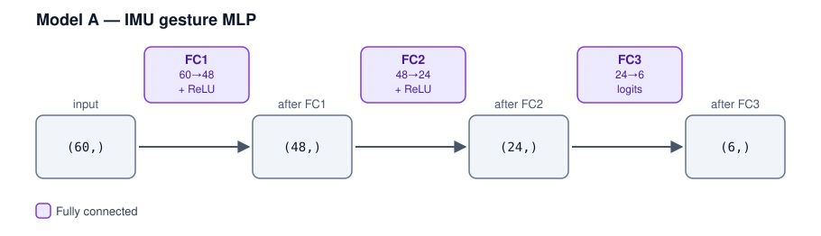
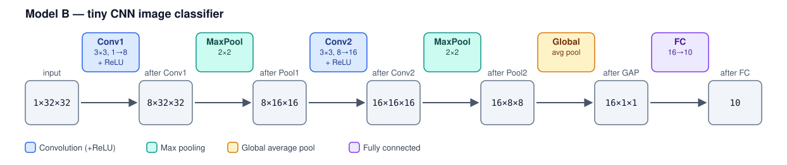

# Activity 2: Memory Budgeting — By Hand, Then Validated
### Embedded AI — Memory Budgeting for Neural Nets
### Board context: STM32F4DISCOVERY (STM32F407VG) — 1 MB Flash, 128 KB SRAM (+64 KB CCM)

Goal: compute weight memory and peak activation memory by hand for two models, self-check your arithmetic, then validate against ExecuTorch's real memory planner. Part 1 is a warm-up (MLP). Part 2 is where the lesson lands (CNN) — expect your intuition about "model size" to be challenged.

Companion files: `memory_calc.py`, `executorch_memory_check.py`

All calculations use **float32 (4 bytes/parameter, 4 bytes/activation element)**. We are deliberately not quantizing yet — that's a later unit.

## 0. Prerequisites

- `memory_calc.py` is a small self-check calculator. It applies the simplified reuse model from lecture to Model A and Model B and prints each layer's weight bytes, each tensor's size, the naive total, and the peak activation memory. It does not use ExecuTorch, so it only needs the Python standard library — run it with any `python3` (including within the et-env).
- `executorch_memory_check.py` is the ground-truth check. It defines the same two models in PyTorch, exports each one through ExecuTorch (`export` → `to_edge()` → `to_executorch()`), which runs the real memory planner, and then reports what the planner actually allocated: it prints the planned buffer sizes and writes a Chrome-trace JSON file. It imports `torch` and `executorch`, so it must be run in the Python virtual environment where you installed ExecuTorch during the Week 1–3 setup. Activate that environment first (e.g., `source ~/executorch/et-env/bin/activate`), then confirm it works:
  ```
  python3 -c "import torch, executorch; print('ok')"
  ```
  If this prints `ModuleNotFoundError`, you're in the wrong environment.
- The script writes its output files (`model_a_memory_profile.json`, `model_b_memory_profile.json`) to your current directory.

---

## Part 1: Model A — IMU Gesture MLP

Architecture:
```
Input: 60 features (float32)
  -> FC1: 60 -> 48, ReLU
  -> FC2: 48 -> 24, ReLU
  -> FC3: 24 -> 6   (6 gesture classes, output logits)
```



Shapes like `(60,)` are 1-D tensors: `(60,)` is Python's way of writing a one-element tuple, meaning a single vector of 60 values (the batch dimension of 1 is left out).

### Step 1 — Predict (before any arithmetic)

Rank the three FC layers by weight memory, largest to smallest. Rank the three layer transitions by activation memory, largest to smallest. Write both rankings down before Step 2 — you'll check them after.

Weight memory ranking: ______________________

Activation memory ranking: ______________________

### Step 2 — Hand-calculate weight memory

For each FC layer, using `params = (in × out) + out`:

| Layer | in | out | params | bytes (×4) |
|---|---|---|---|---|
| FC1 | 60 | 48 | | |
| FC2 | 48 | 24 | | |
| FC3 | 24 | 6 | | |
| **Total** | | | | |

### Step 3 — Hand-calculate activation memory

Fill in each tensor's size (elements × 4 bytes):

| Tensor | shape | bytes |
|---|---|---|
| input | (60,) | |
| after FC1 | (48,) | |
| after FC2 | (24,) | |
| after FC3 | (6,) | |

Using the simple reuse model from lecture (peak = max over each op of input_bytes + output_bytes):

| Op | input + output bytes |
|---|---|
| FC1 | |
| FC2 | |
| FC3 | |
| **Peak (max of above)** | |

Also compute the **naive total** (sum of every tensor above, as if nothing were reused): __________

### Step 4 — Self-check with `memory_calc.py`

```
python3 memory_calc.py
```
Compare the "Model A" section's output against your Step 2/3 numbers. They should match exactly — if they don't, find the discrepancy before moving on (common mistakes: forgetting the bias term, using element count instead of bytes, or including the input tensor's memory in the weight total).

### Step 5 — Validate against the real ExecuTorch planner

```
python3 executorch_memory_check.py model_a
```
This exports the actual model, runs it through `to_edge()` and `to_executorch()`, and either writes a Chrome-trace file you can inspect at `chrome://tracing`, or prints planned buffer sizes directly (depending on what your installed ExecuTorch version supports — the script tries both).

**Task:** Record the real planner's peak/total planned buffer size:

Real planner total: ______________________ bytes

Compare it to your Step 3 peak. If the real number is smaller, why might that be, given what the lecture said about the planner not being limited to a single input/output pair? If it's larger, what might account for the difference (padding/alignment, a tensor you didn't count, ReLU not being fused the way we assumed)?

Your explanation:

______________________________________________________________
______________________________________________________________

*Hint for investigating:* the trace file lists every tensor the planner allocated, not just the ones in the architecture diagram above. Look at what's in it.

---

## Part 2: Model B — Tiny CNN Image Classifier

Architecture:
```
Input: 1x32x32 grayscale image (float32)
  -> Conv1: 3x3 kernel, 1->8 channels, padding=1, ReLU     -> 8x32x32
  -> MaxPool 2x2                                           -> 8x16x16
  -> Conv2: 3x3 kernel, 8->16 channels, padding=1, ReLU    -> 16x16x16
  -> MaxPool 2x2                                           -> 16x8x8
  -> Global Average Pool                                   -> 16x1x1
  -> FC: 16 -> 10  (10 classes)
```



### Step 1 — Predict

Before calculating anything: this network has far fewer total weights than Model A's largest layer. Write down a guess for total weight memory (in KB) and peak activation memory (in KB). You'll compare against your actual answer in Step 4 — most people's first guess is off by an order of magnitude in one direction or the other. That's the point.

Guess — weight memory: __________ KB    peak activation memory: __________ KB

### Step 2 — Hand-calculate weight memory

Using `params = (k × k × in_ch × out_ch) + out_ch` for conv layers, and the FC formula from Part 1:

| Layer | params | bytes (×4) |
|---|---|---|
| Conv1 (3×3, 1→8) | | |
| Conv2 (3×3, 8→16) | | |
| FC (16→10) | | |
| **Total** | | |

(Pooling and global-average-pool layers have no weights.)

### Step 3 — Hand-calculate activation memory

| Tensor | shape | elements | bytes |
|---|---|---|---|
| input | 1×32×32 | | |
| after Conv1 | 8×32×32 | | |
| after Pool1 | 8×16×16 | | |
| after Conv2 | 16×16×16 | | |
| after Pool2 | 16×8×8 | | |
| after GAP | 16×1×1 | | |
| after FC | 10 | | |

Peak activation memory (max of input+output bytes across each op):

| Op | input + output bytes |
|---|---|
| Conv1 | |
| Pool1 | |
| Conv2 | |
| Pool2 | |
| GAP | |
| FC | |
| **Peak (max of above)** | |

### Step 4 — Compare to your Step 1 prediction

Write down: total weight memory (KB), peak activation memory (KB), and the ratio between them. How far off was your Step 1 guess? Which one surprised you more — how small the weights were, or how large the peak activation was?

Weight memory: __________ KB    Peak activation: __________ KB    Ratio: __________

### Step 5 — Self-check and validate

```
python3 memory_calc.py
python3 executorch_memory_check.py model_b
```
Same process as Part 1: confirm your hand arithmetic against the script, then confirm the script's simplified model against ExecuTorch's real planner output.

Real planner total: ______________________ bytes

### Step 6 — The punchline, in writing

Answer in 2-3 sentences: given your Step 2 and Step 3 totals, would this model fit on a hypothetical MCU with 1 MB Flash but only 32 KB of SRAM? What single number determines the answer, and is it the number most people would check first?

______________________________________________________________
______________________________________________________________
______________________________________________________________

---

## Wrap-up discussion (whole class)

1. Compare Model A and Model B's weight-memory-to-activation-memory ratios. What architectural choice in Model B (conv layers processing full spatial resolution before pooling) is directly responsible for its large peak activation, and what's one design change that would shrink it (hint: where in the network does pooling happen relative to the largest tensor)?
2. In Step 5 of each part, did the real ExecuTorch planner's number match your hand calculation exactly, come in lower, or come in higher? What does that tell you about the difference between the simplified "adjacent pair" model from lecture and ExecuTorch's actual greedy lifetime-based allocator?
3. If you were designing a third model for this board, which number would you watch more closely while sketching the architecture on paper, before ever exporting it: total parameter count, or the shape of the largest intermediate tensor?
